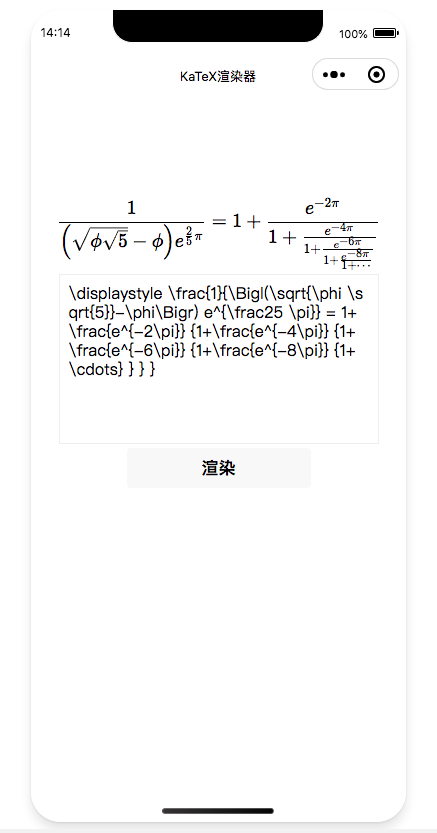

# katex-weapp

基于 KaTeX 使用 Taro 3.0 构建的小程序原生 LaTeX 渲染组件（不依赖服务端渲染）

> 依赖微信小程序的 RichText 组件渲染，请注意小程序基础库 1.4.0 开始支持，低版本需做兼容处理。

## 运行 demo

```bash
# clone 项目
git clone https://github.com/rojer95/katex-weapp.git

# 项目根目录安装依赖
yarn

# 编译
yarn dev:weapp

```

编译后:

- 打开小程序开发者工具, 打开 dist 目录
- 可以修改文本框内容 Latex 公式，点击渲染查看效果

## 在原生小程序项目中使用

```bash
# clone 项目
git clone https://github.com/rojer95/katex-weapp.git

# 项目根目录安装依赖
yarn

# 编译组件
yarn build:weapp:components

```

组件编译后:

- 复制`dist`文件夹的到你的原生项目中，并改名为 `katex`
- 在 `[page].json` 中做组件声明

```json
{
  "usingComponents": {
    "katex": "../../katex/components/katex"
  }
}
```

- 在 `[page].wxml` 中使用

```xml
<!--index.wxml-->
<view class="container">
  <katex props="{{katexProps}}"></katex>
</view>
```

- 在 `[page].js` 中配置 props

```js
// index.js
Page({
  data: {
    katexProps: {
      latex: "x=a^2"
    }
  }
});
```

原生小程序中使用，详见 [Demo](./demo)

## 示例预览图



## 缺点

- 占用体积较大 500k+
